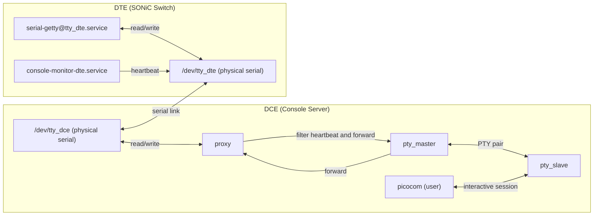
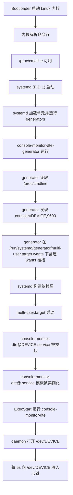
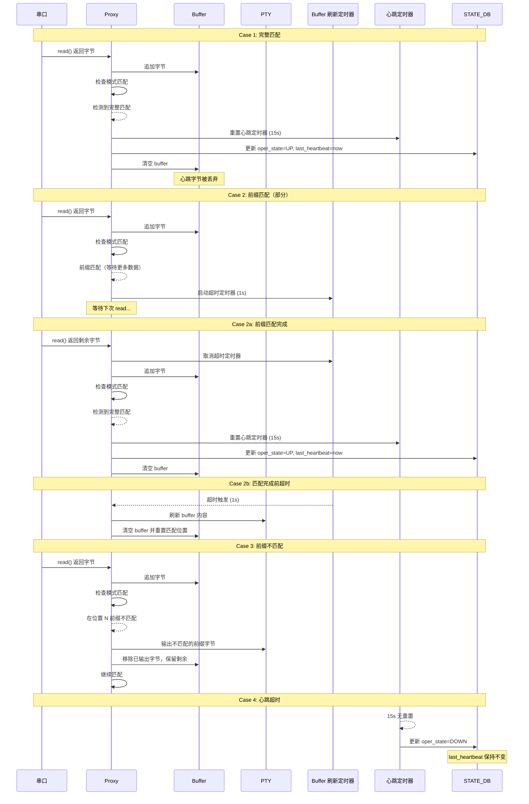

# SONiC Console Monitor

## High Level Design Document

### Revision 1.0

---

## 目录

- [术语与缩写](#术语与缩写)
- [1. 功能概述](#1-功能概述)
  - [1.1 功能需求](#11-功能需求)
  - [1.2 设计目标](#12-设计目标)
- [2. 设计概述](#2-设计概述)
  - [2.1 架构](#21-架构)
  - [2.2 DTE 侧](#22-dte-侧)
  - [2.3 DCE 侧](#23-dce-侧)
- [3. 详细设计](#3-详细设计)
  - [3.1 帧结构设计](#31-帧结构设计)
  - [3.2 DTE 侧服务](#32-dte-侧服务)
  - [3.3 DCE 侧 Console Monitor DCE 服务](#33-dce-侧-console-monitor-dce-服务)
- [4. 数据库更改](#4-数据库更改)
- [5. CLI](#5-cli)
- [6. 流程图](#6-流程图)
- [7. 参考资料](#7-参考资料)

---

## 术语与缩写

| 术语 | 定义 |
|------|------|
| DCE | Data Communications Equipment - Console Server 侧 |
| DTE | Data Terminal Equipment - SONiC Switch（被管理设备）侧 |
| Heartbeat | 用于验证链路连通性的周期性信号 |
| Oper | 运行状态（Up/Down） |
| PTY | Pseudo Terminal - 虚拟终端接口 |
| Proxy | 处理串口通信的中间代理进程 |
| TTY | Teletypewriter - 终端设备接口 |

---

## 1. 功能概述

在数据中心网络中，Console Server（DCE）通过串口直连多台 SONiC Switch（DTE），用于故障时的带外管理与控制台接入。consoled 服务提供链路 Oper 状态探测功能。

### 1.1 功能需求

*   **连通性检测（Heartbeat）**
    *   判断 DCE ↔ DTE 串口链路是否可用（Oper Up/Down）
*   **非侵入式（Non-Interference）**
    *   不影响正常 Console 运维，包括远程设备冷重启和系统重装
*   **高可用与持久化（HA & Persistence）**
    *   进程/系统重启后可恢复状态
    *   对端重启后可自动恢复探测

### 1.2 设计目标

| 目标 | 描述 |
|------|------|
| 可靠性 | 准确的链路状态检测，最小化误报/漏报 |
| 非侵入 | 对正常控制台操作零影响 |
| 低开销 | 最小化资源消耗和用户侧延迟 |
| 自动恢复 | 任意一侧重启后自动恢复 |

---

## 2. 设计概述

### 2.1 架构



设计核心：将 DCE 侧直接的"用户 ↔ 串口"访问模式转变为"用户 ↔ Proxy ↔ 串口"模式。

### 2.2 DTE 侧

DTE 周期性向串口发送特定格式的心跳帧。

*   **单向数据流**
    *   DTE → DCE 方向，保证 DTE 重启阶段不会收到 DCE 侧协议干扰数据
*   **碰撞风险**
    *   正常数据流中可能包含心跳帧格式的数据，导致误判
    *   通过心跳帧设计降低碰撞概率

### 2.3 DCE 侧

在物理串口和用户应用之间创建 Proxy，负责心跳帧检测、过滤和链路状态维护。

*   **独占权**
    *   唯一持有物理串口文件描述符（`/dev/ttyUSBx`）的进程
*   **PTY 创建**
    *   为上层应用创建伪终端对
*   **PTY 符号链接**
    *   创建固定符号链接（如 `/dev/VC0-1`）指向动态 PTY slave（如 `/dev/pts/3`）
    *   上层应用（consutil、picocom）使用稳定的设备路径
*   **心跳过滤**
    *   识别心跳帧，更新状态，并丢弃心跳数据
*   **数据透传**
    *   非心跳数据透明转发到虚拟串口

---

## 3. 详细设计

### 3.1 帧结构设计

#### 3.1.1 设计原则

*   **可靠检测**
    *   可从任意字节流中区分心跳帧
    *   支持从帧中间开始读取时恢复对齐
*   **容错性**
    *   使用 3 字节同步序列作为帧定界符
    *   单个字节的 bit error 不会导致帧同步丢失
*   **透明传输**
    *   转义机制确保帧内容可包含任意字节

#### 3.1.2 关键假设

*   用户数据流中不会出现特殊字符，0x01 (SOF), 0x1B (EOF), 0x10 (DLE)
*   bit error 连续在 3 个字节中出现的概率可忽略不计

#### 3.1.3 特殊字符定义

| 字符 | 值 (Hex) | 名称 | 描述 |
|------|----------|------|------|
| SOF | 0x01 | Start of Frame | 帧起始字符 |
| EOF | 0x1B | End of Frame | 帧结束字符 |
| DLE | 0x10 | Data Link Escape | 转义字符 |

**定界符选择说明：**

*   **SOF (0x01)**
    *   ASCII SOH (Start of Heading)
    *   不可打印字符，正常终端输出中极少出现
*   **EOF (0x1B)**
    *   ASCII ESC
    *   虽然在终端控制序列中常见，但通过转义机制处理
*   **DLE (0x10)**
    *   ASCII DLE (Data Link Escape)
    *   用于转义帧内容中的特殊字符

**同步序列设计：**

*   **帧头同步序列**
    *   3 个连续的 SOF 字符：0x01 0x01 0x01
    *   收到任何一个SOF都会起到状态转换的作用，而不是收到连续的三个SOF才会触发状态转换
    *   单个 SOF 发生 bit error 不会导致帧同步丢失
*   **帧尾同步序列**
    *   3 个连续的 EOF 字符：0x1B 0x1B 0x1B
    *   同样，收到任何一个EOF字符都会触发状态转换
    *   同样提供 bit error 容错能力

#### 3.1.4 转义规则

当帧内容（帧头和帧尾之间）包含特殊字符时，需要进行转义：

| 原始字节 | 转义后 |
|----------|--------|
| 0x01 (SOF) | 0x10 0x01 |
| 0x1B (EOF) | 0x10 0x1B |
| 0x10 (DLE) | 0x10 0x10 |

**转义处理说明：**

*   **发送端**
    *   构造原始帧内容（Version + Seq + Flag + Type + Length + Payload）
    *   计算 CRC16（基于原始未转义数据）
    *   对整个帧内容（包括 CRC16）进行转义
    *   最后添加帧头和帧尾
*   **接收端**
    *   去除帧头和帧尾后，剩下的原始数据（包括转义字符）存入帧 buffer 中
    *   先对 buffer 进行去转义
    *   然后进行 CRC16 校验
    *   校验通过后提取各字段数据

#### 3.1.5 帧格式

```
+----------+--------+-----+------+------+--------+---------+-------+----------+
| SOF x 3  | Version| Seq | Flag | Type | Length | Payload | CRC16 | EOF x 3  |
+----------+--------+-----+------+------+--------+---------+-------+----------+
|    3B    |   1B   | 1B  |  1B  |  1B  |   1B   |   N B   |  2B   |    3B    |
+----------+--------+-----+------+------+--------+---------+-------+----------+
```

| 字段 | 大小 | 描述 |
|------|------|------|
| SOF x 3 | 3 字节 | 帧头同步序列，0x01 0x01 0x01 |
| Version | 1 字节 | 协议版本，当前为 0x01 |
| Seq | 1 字节 | 序列号，0x00-0xFF 循环递增 |
| Flag | 1 字节 | 标志位，保留字段，当前为 0x00 |
| Type | 1 字节 | 帧类型 |
| Length | 1 字节 | Payload 长度（0-255，原始长度） |
| Payload | N 字节 | 可选数据载荷 |
| CRC16 | 2 字节 | 校验和，大端序（高字节在前） |
| EOF x 3 | 3 字节 | 帧尾同步序列，0x1B 0x1B 0x1B |

**帧长度限制：**

*   **最大帧长度**
    *   去掉帧头帧尾后，不超过 64 字节
    *   Length的值 <= 24
    *   帧长度 <= buffer 长度确保从帧中间开始读取时能恢复对齐
*   **Buffer 大小**
    *   64 字节，可根据需求调整

**CRC16 计算：**

*   **算法**
    *   CRC-16/MODBUS（多项式 0x8005，初始值 0xFFFF，反射输入/输出）
*   **计算范围**
    *   从 Version 到 Payload（不包含转义字符，使用原始数据）
    *   不包括帧头、CRC16 本身、帧尾
*   **字节序**
    *   大端序（高字节在前，低字节在后）

#### 3.1.6 帧类型定义

| Type | 值 (Hex) | 描述 |
|------|----------|------|
| HEARTBEAT | 0x01 | 心跳帧 |
| 保留 | 0x02-0xFF | 未来扩展 |

#### FLAG字段定义

标志位保留，当前默认为0x00

#### 3.1.7 心跳帧示例
```
01 01 01 01 00 00 01 00 XX XX 1B 1B 1B
└──┬──┘ │  │  │  │  │  └──┬─┘ └──┬──┘
   │    │  │  │  │  │     │      └── EOF x 3 (帧尾同步序列)
   │    │  │  │  │  │     └── CRC16 (计算值)
   │    │  │  │  │  └──────── Length: 0 (无 payload)
   │    │  │  │  └─────────── Type: HEARTBEAT (0x01)
   │    │  │  └────────────── Flag: 0x00
   │    │  └───────────────── Seq: 0x00 (序列号)
   │    └──────────────────── Version: 0x01
   └───────────────────────── SOF x 3 (帧头同步序列)
```

---

#### 3.3.3 帧检测与过滤

**Buffer 设计：**

*   **Buffer**
    *   固定大小 64 字节
    *   存储除了SOF，EOF以外的所有数据
*   **设计原则**
    *   帧头、帧尾不入 buffer
    *   帧内容（包括 DLE 和被转义字符）全部入 buffer
    *   CRC16 校验使用 buffer 中的数据
    *   校验通过后再去转义提取原始数据


**检测算法：**

```python
# 状态变量
in_frame = False  # 是否在帧内

def process_bytes(data: bytes) -> bytes:

    for b in data:

        if b == SOF:
            if not in_frame:
                # 不在帧内，当前 buffer 是用户数据
                send_to_user(buffer)
            # else: 在帧内收到 SOF，说明之前的帧不完整，丢弃
            buffer.clear()
            pos = 0
            in_frame = True  # 进入帧内状态
        
        elif b == EOF:
            parse_frame(buffer)
            buffer.clear()
            pos = 0
            in_frame = False  # 退出帧内状态

        else:
            buffer.append(b)
            pos += 1

        if pos >= MAX_FRAME_SIZE:
            if not in_frame:
                send_to_user(buffer)
            # else: 在帧内溢出，帧无效，丢弃
            buffer.clear()
            pos = 0
            in_frame = False

# 0.5s 内没有读取到任何数据
def on_read_timeout():
    if buffer:
        if not in_frame:
            # 不在帧内，buffer 是用户数据
            send_to_user(buffer)
        # else: 在帧内超时，帧不完整，丢弃
        buffer.clear()
        pos = 0
        in_frame = False

```

**帧处理流程：**

算法说明：
*   **状态跟踪**: 使用 `in_frame` 变量跟踪当前是否在帧内（SOF 和 EOF 之间）
*   收到SOF（帧起始符）时：
    *   如果不在帧内：将当前缓冲区内容作为普通数据发送给用户
    *   如果在帧内：说明之前的帧不完整，丢弃缓冲区内容
    *   进入帧内状态
*   收到EOF（帧结束符）时：解析缓冲区中的帧数据，退出帧内状态
*   收到其他字节时：将字节添加到缓冲区
*   缓冲区溢出保护：
    *   如果不在帧内：将内容作为普通数据发送给用户
    *   如果在帧内：帧无效，丢弃缓冲区内容
    *   退出帧内状态
*   **超时处理**: 当 0.5s 内没有新数据时：
    *   如果不在帧内：将缓冲区作为用户数据发送
    *   如果在帧内：帧不完整，丢弃缓冲区内容
    *   退出帧内状态

---

### 3.2 DTE 侧服务

#### 3.2.1 服务: `console-monitor-dte@<DEVICE_NAME>.service`

DTE 侧服务以固定 5 秒间隔周期性发送心跳帧。

*   **发送周期**
    *   固定 5 秒
*   **服务实例**
    *   使用 systemd 模板单元按串口生成
*   **自动激活**
    *   由 systemd generator 根据内核命令行参数创建

#### 3.2.2 服务启动与管理

DTE 侧服务使用 systemd generator 根据内核命令行参数中的串口配置自动创建 `console-monitor-dte@.service` 实例。

Generator 读取这些参数，在 `/run/systemd/generator/` 下创建对应的 wants 链接，使每个服务实例无需手动配置即可周期性发送心跳帧。



---

### 3.3 DCE 侧 Console Monitor DCE 服务

#### 3.3.1 服务: `console-monitor-dce.service`

拓扑：


每条链路有独立的 Proxy 实例，负责串口读写与状态维护。

#### 3.3.2 超时判定

超时周期默认 15 秒。如果在此期间未收到心跳，链路状态判定为 Down。

#### 3.3.4 Oper 状态判定

每条链路维护独立状态。收到心跳时，Proxy 更新心跳计时器并将 oper 状态设为 UP。每 15 秒执行定时检查，如果最近 15 秒内未收到心跳，oper 状态设为 DOWN。状态变更写入 STATE_DB。

STATE_DB 条目：

*   Key: `CONSOLE_PORT|<link_id>`
*   Field: `oper_state`, Value: `up` / `down`
*   Field: `last_heartbeat`, Value: `<timestamp>`

#### 3.3.5 服务启动与初始化

console-monitor-dce 服务按以下顺序启动：

1.  **等待依赖**
    *   在 `config-setup.service` 完成将 config.json 加载到 CONFIG_DB 后启动
2.  **连接 Redis**
    *   建立到 CONFIG_DB 和 STATE_DB 的连接
3.  **检查 Console 功能**
    *   验证 CONFIG_DB 中 `CONSOLE_SWITCH|console_mgmt` 的 `enabled` 字段是否为 `"yes"`
    *   如禁用则立即退出
4.  **读取 PTY 符号链接前缀**
    *   从 `<platform_path>/udevprefix.conf` 读取设备前缀（如 `C0-`）
    *   构造虚拟设备前缀 `/dev/V<prefix>`（如 `/dev/VC0-`）
5.  **初始化 Proxy 实例**
    *   为 CONFIG_DB 中的每个串口配置：
        *   打开物理串口（如 `/dev/C0-1`）
        *   创建 PTY 对（master/slave，如 `/dev/pts/X`）
        *   创建符号链接（如 `/dev/VC0-1` → `/dev/pts/3`）
        *   配置串口和 PTY 为 raw 模式
        *   将文件描述符注册到 asyncio 事件循环
        *   启动心跳超时定时器（15 秒）
6.  **订阅配置变更**
    *   监听 CONFIG_DB keyspace 事件以动态重配置
7.  **进入主循环**
    *   处理串口数据，过滤心跳，更新 STATE_DB
8.  **初始状态**
    *   15 秒内无心跳，`oper_state` 设为 `down`
    *   收到首个心跳后，`oper_state` 变为 `up`，记录 `last_heartbeat` 时间戳

#### 3.3.6 动态配置变更

*   监听 CONFIG_DB 配置变更事件
*   动态添加、删除或重启链路的 Proxy 实例

#### 3.3.7 服务关闭与清理

当 console-monitor-dce 服务收到关闭信号（SIGINT/SIGTERM）时，每个 proxy 执行清理：

*   **STATE_DB 清理**
    *   仅删除 `oper_state` 和 `last_heartbeat` 字段
    *   保留 consutil 管理的 `state`、`pid`、`start_time` 字段
*   **PTY 符号链接**
    *   删除符号链接（如 `/dev/VC0-1`）
*   **Buffer 刷新**
    *   如 filter buffer 非空，刷新到 PTY

---

## 4. 数据库更改

### 4.1 STATE_DB

表: CONSOLE_PORT_TABLE

| Key 格式 | Field | Value | 描述 |
|----------|-------|-------|------|
| `CONSOLE_PORT|<link_id>` | `oper_state` | `up` / `down` | 链路运行状态 |
| `CONSOLE_PORT|<link_id>` | `last_heartbeat` | `<timestamp>` | 最后心跳接收时间 |

---

## 5. CLI

`show line` 命令增加链路 Oper 状态显示：

```
admin@sonic:~$ show line
```

输出：

```
  Line    Baud    Flow Control    PID    Start Time      Device    Oper Status          Last Heartbeat
------  ------  --------------  -----  ------------  ----------  -------------  ----------------------
     1    9600        Disabled      -             -   Terminal1             up  12/31/2025 10:11:29 PM
     2    9600        Disabled      -             -   Terminal2           down                       -
```

新增列：

| 列名 | 描述 |
|------|------|
| Oper Status | 控制台链路当前运行状态 |
| Last Heartbeat | 最近一次心跳接收的时间戳 |

---

## 6. 流程图

### 6.1 心跳帧检测与过滤流程



---

## 7. 参考资料

1. [SONiC Console Switch High Level Design](https://github.com/sonic-net/SONiC/blob/master/doc/console/SONiC-Console-Switch-High-Level-Design.md#scope)
2. [Systemd Generator Man Page](https://www.freedesktop.org/software/systemd/man/systemd.generator.html)
3. [Systemd Getty Generator Source Code](https://github.com/systemd/systemd/blob/main/src/getty-generator/getty-generator.c)
4. [Getty Explanation](https://0pointer.de/blog/projects/serial-console.html)
5. [ASCII Code](https://www.ascii-code.com/)
