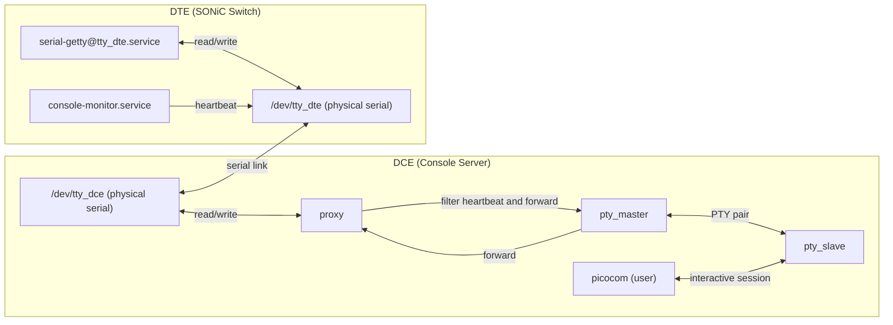
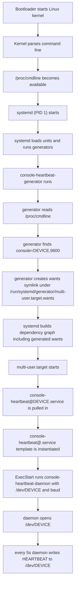
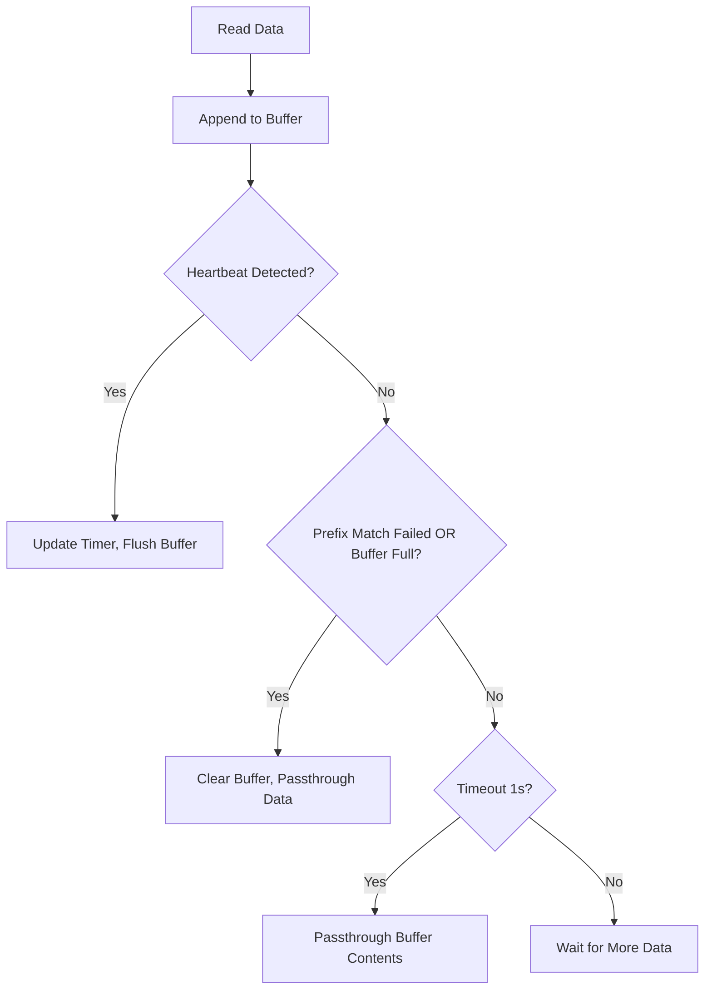
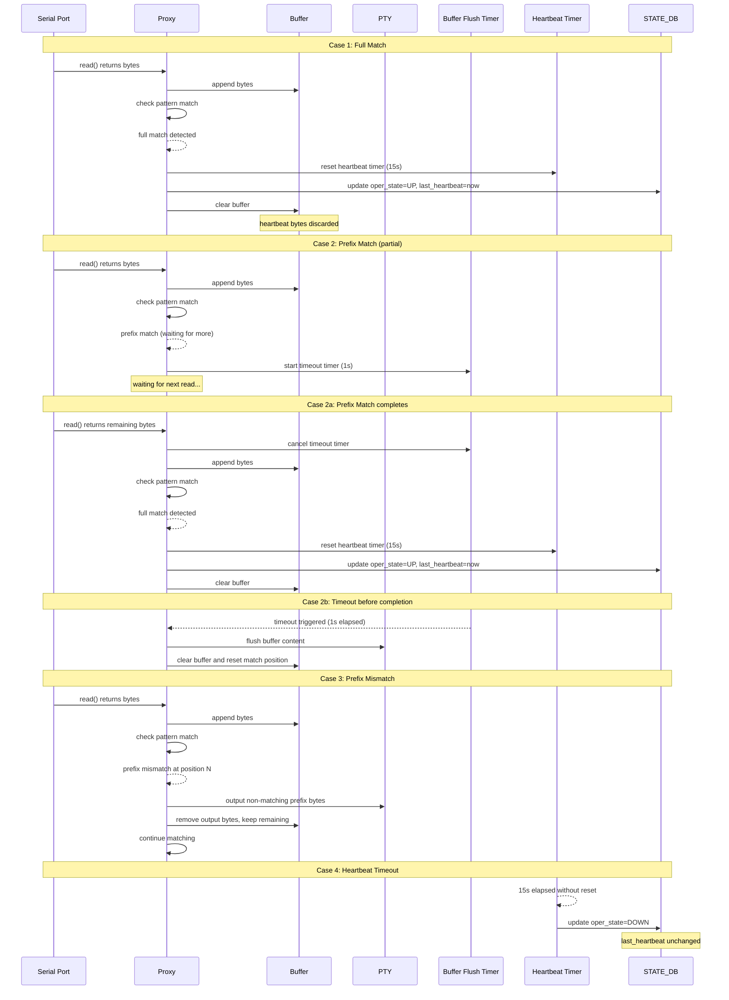

# SONiC Console Monitor

## High Level Design Document

### Revision 1.0

---

## Table of Contents

- [Revision History](#revision-history)
- [Scope](#scope)
- [Definitions and Abbreviations](#definitions-and-abbreviations)
- [1. Feature Overview](#1-feature-overview)
  - [1.1 Functional Requirements](#11-functional-requirements)
  - [1.2 Design Goals](#12-design-goals)
- [2. Design Overview](#2-design-overview)
  - [2.1 Architecture](#21-architecture)
  - [2.2 DTE Side (Managed Device)](#22-dte-side-managed-device)
  - [2.3 DCE Side (Proxy Process)](#23-dce-side-proxy-process)
- [3. Detailed Design](#3-detailed-design)
  - [3.1 Heartbeat Frame Design](#31-heartbeat-frame-design)
  - [3.2 DTE Side Service](#32-dte-side-service)
  - [3.3 DCE Side Console Monitor Service](#33-dce-side-console-monitor-service)
- [4. Database Changes](#4-database-changes)
  - [4.1 STATE_DB](#41-state_db)
- [5. CLI](#5-cli)
- [6. Flow Diagrams](#6-flow-diagrams)
- [7. References](#7-references)

---

## Revision History

---

## Scope

This document describes the high-level design of the SONiC Console Monitor (consoled, console-daemon) feature. The consoled service provides link operational status detection for console connections between Console Servers (DCE) and SONiC Switches (DTE) in data center networks.

---

## Definitions and Abbreviations

| Term      | Definition                                                                 |
|-----------|----------------------------------------------------------------------------|
| DCE       | Data Communications Equipment - Console Server side                        |
| DTE       | Data Terminal Equipment - SONiC Switch (managed device) side              |
| Heartbeat | Periodic signal sent to verify link connectivity                          |
| Oper      | Operational status (Up/Down)                                              |
| PTY       | Pseudo Terminal - Virtual terminal interface                              |
| Proxy     | Intermediary process handling serial port communication                   |
| TTY       | Teletypewriter - Terminal device interface                                |

---

## 1. Feature Overview

In data center networks, Console Servers (DCE) are directly connected to multiple SONiC Switches (DTE) via serial ports for out-of-band management and console access during failures. The consoled service provides link operational status detection with the following capabilities:

### 1.1 Functional Requirements

1. **Connectivity Detection (Heartbeat)**: Determine whether the DCE ↔ DTE serial link is available (Oper Up/Down)
2. **Non-Interference**: Must not affect normal console operations, including remote device cold restart and system reinstallation.
3. **High Availability & Persistence**: State recovery after process/system restart; automatic detection recovery after remote device restart

### 1.2 Design Goals

| Goal                | Description                                                              |
|---------------------|--------------------------------------------------------------------------|
| Reliability         | Accurate link status detection with minimal false positives/negatives   |
| Non-intrusive       | Zero impact on normal console operations                                |
| Low Overhead        | Minimal resource consumption and user-side latency                      |
| Automatic Recovery  | Self-healing after restarts on either side                              |

---

## 2. Design Overview

### 2.1 Architecture



The core design transforms the direct "User ↔ Serial Port" access model into a "User ↔ Proxy ↔ Serial Port" model on the DCE side.

### 2.2 DTE Side

The DTE periodically sends heartbeat frames with a specific format to the serial port.


- **One-way Data Flow**: DTE → DCE only, ensuring no interference from DCE-side protocol data during DTE reboot phase
- **Collision Risk Mitigation**: There is a small probability that normal data streams may contain heartbeat frame patterns, causing false detection. This risk is minimized through careful heartbeat frame design

### 2.3 DCE Side

Create a proxy between each physical serial port and user applications. The proxy is responsible for heartbeat frame detection, filtering from the serial data stream, and maintaining link operational state.

- **Exclusive Access**: Sole process holding the physical serial port file descriptor (`/dev/ttyUSBx`)
- **PTY Creation**: Creates a pseudo-terminal pair for upper-layer applications
- **PTY Symlink**: Creates a fixed symbolic link (e.g., `/dev/VC0-1`) pointing to the dynamic PTY slave (e.g., `/dev/pts/3`), allowing upper-layer applications (consutil, picocom) to use a stable device path
- **Heartbeat Filtering**: Identifies heartbeat frames, updates state, and discards them
- **Data Passthrough**: Transparently forwards non-heartbeat data to the virtual serial port

---

## 3. Detailed Design

### 3.1 Heartbeat Frame Design

#### 3.1.1 Design Principles

1. **Reliable Detection**: Must be distinguishable from arbitrary byte streams; avoid misdetection due to read() call fragmentation
2. **Low Collision Rate**: Minimize false positives where normal user output is mistakenly identified as heartbeat frames

#### 3.1.2 Frame Format

The heartbeat frame uses a 4-byte sequence of unused Extended ASCII codes (0x80-0x9F range), which are rarely used in normal terminal output, reducing collision probability.

**Heartbeat Byte Sequence:**

```
8D 90 8F 9D
```

| Byte Position | Value (Hex) | Description                          |
|---------------|-------------|--------------------------------------|
| 0             | 8D          | Unused Extended ASCII   |
| 1             | 90          | Unused Extended ASCII   |
| 2             | 8F          | Unused Extended ASCII   |
| 3             | 9D          | Unused Extended ASCII   |

---

### 3.2 DTE Side Service

#### 3.2.1 Service: `console-heartbeat@<DEVICE_NAME>.service`

The DTE side service periodically sends heartbeat frames to the serial port with a fixed 5-second interval.

**Key Characteristics:**

- **Send Interval**: Fixed at 5 seconds
- **Service Instance**: Generated per serial port using systemd template units
- **Automatic Activation**: Created by systemd generator based on kernel command line parameters

#### 3.2.2 Service Startup and Management

The DTE side service uses a systemd generator to automatically create `console-heartbeat@.service` instances based on serial port configurations passed via kernel command line parameters. The generator reads these parameters and creates corresponding service instance wants links in `/run/systemd/generator/`, enabling each service instance to periodically send heartbeat frames to its designated serial port without manual configuration.



---

### 3.3 DCE Side Console Monitor Service

#### 3.3.1 Service: `console-monitor.service`

**Topology:**


Each link has an independent Proxy instance responsible for serial port read/write operations and state maintenance.

#### 3.3.2 Timeout Detection

The timeout period is set to 15 seconds by default. If no heartbeat is received within this duration, the link operational state is declared as Down.

#### 3.3.3 Heartbeat Frame Detection and Filtering

To handle cases where read() calls may return partial heartbeat frames, a sliding buffer mechanism (similiar to KMP algorithm) is implemented:

**Algorithm:**

1. **Buffer Size**: `heartbeat_length - 1` bytes
2. **On Data Read**: Append new data to the sliding buffer tail
3. **Pattern Matching**:
   - If complete heartbeat detected → Update heartbeat timer, flush buffer
   - If prefix match fails OR buffer full → Clear buffer, passthrough to upper layer
   - If no match within 1 second → Passthrough buffer contents to prevent data blocking

**State Diagram:**



#### 3.3.4 Operational State Determination

Each link maintains independent state. When a heartbeat is received, the proxy updates the heartbeat timer and sets the oper state to UP. A scheduled check runs every 15 seconds, if no heartbeat has been received within the last 15 seconds, the oper state is set to DOWN. Any state change is written to STATE_DB.

**STATE_DB Entry:**

- **Key**: `CONSOLED_PORT|<link_id>`
- **Field**: `oper_state`, **Value**: `up` / `down`
- **Field**: `last_heartbeat`, **Value**: `<timestamp>`

#### 3.3.5 Service Startup and Initialization

The console-monitor service follows this startup sequence:

1. **Wait for Dependencies**: Start after `config-setup.service` completes loading `config.json` to CONFIG_DB
2. **Read PTY Symlink Prefix**: Read device prefix from `<platform_path>/udevprefix.conf` (e.g., `C0-`), construct virtual device prefix as `/dev/V<prefix>` (e.g., `/dev/VC0-`)
3. **Connect to Redis**: Establish connections to CONFIG_DB and STATE_DB
4. **Initialize Proxy Instances**: For each serial port configuration in CONFIG_DB:
   - Open physical serial port (e.g., `/dev/C0-1`)
   - Create PTY (e.g. `/dev/pts/X`)
   - Create symlink from fixed path to dynamic PTY (e.g., `/dev/VC0-1` → `/dev/pts/3`)
   - Configure serial port and PTY with raw mode settings
   - Register file descriptors with asyncio event loop
   - Start heartbeat timeout timer (15 seconds)
5. **Subscribe to Config Changes**: Monitor CONFIG_DB keyspace events for dynamic reconfiguration
6. **Enter Main Loop**: Process serial data, filter heartbeats, update STATE_DB
7. **Initial State**: After 15 seconds without heartbeat, `oper_state` is set to `down`; upon first heartbeat reception, `oper_state` becomes `up` with `last_heartbeat` timestamp

#### 3.3.6 Dynamic Configuration Changes

- Monitor CONFIG_DB for configuration change events
- Dynamically add, remove, or restart Proxy instances for links

---

## 4. Database Changes

### 4.1 STATE_DB

**Table: CONSOLE_PORT_TABLE**

| Key Format                 | Field            | Value              | Description                    |
|----------------------------|------------------|--------------------|--------------------------------|
| `CONSOLED_PORT|<link_id>`  | `oper_state`     | `up` / `down`      | Link operational status        |
| `CONSOLED_PORT|<link_id>`  | `last_heartbeat` | `<timestamp>`      | Last heartbeat reception time  |

---

## 5. CLI

The `show line` command is enhanced to display link operational status:

```
admin@sonic:~$ show line
```

**Output:**

```
  Line    Baud    Flow Control    PID    Start Time      Device    Oper Status          Last Heartbeat
------  ------  --------------  -----  ------------  ----------  -------------  ----------------------
     1    9600        Disabled      -             -   Terminal1             up  12/31/2025 10:11:29 PM
     2    9600        Disabled      -             -   Terminal2           down                       -
```

**New Columns:**

| Column          | Description                                          |
|-----------------|------------------------------------------------------|
| Oper Status     | Current operational status of the console link       |
| Last Heartbeat  | Timestamp of the most recent heartbeat reception     |

---

## 6. Flow Diagrams

### 6.1 Heartbeat Frame Detection and Filtering Process


---

## 7. References

1. [SONiC Console Switch High Level Design](https://github.com/sonic-net/SONiC/blob/master/doc/console/SONiC-Console-Switch-High-Level-Design.md#scope)
2. [Systemd Generator Man Page](https://www.freedesktop.org/software/systemd/man/systemd.generator.html)
3. [Systemd Getty Generator Source Code](https://github.com/systemd/systemd/blob/main/src/getty-generator/getty-generator.c)
4. [Getty Explanation](https://0pointer.de/blog/projects/serial-console.html)
5. [ASCII Code](https://www.ascii-code.com/)