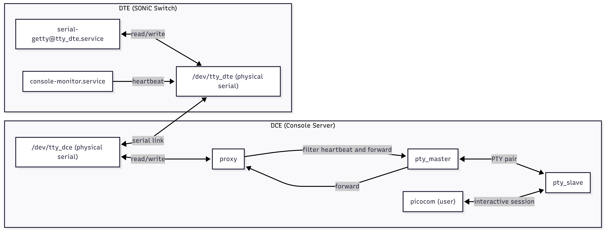

# SONiC consoled (Serial Link State Detection & Interactive Console Handover)

# High Level Design Document

#### Revision 1.0

# Table of Contents

* [List of Tables](#list-of-tables)
* [Revision](#revision)
* [About this Manual](#about-this-manual)
* [Scope](#scope)
* [Definition/Abbreviation](#definitionabbreviation)

  * [Table 1: Abbreviations](#table-1-abbreviations)
* [1 Feature Overview](#1-feature-overview)

  * [1.1 Requirements](#11-requirements)

    * [1.1.1 Functional Requirements](#111-functional-requirements)
    * [1.1.2 Non-Functional Requirements](#112-non-functional-requirements)
    * [1.1.3 Configuration and Management Requirements](#113-configuration-and-management-requirements)
  * [1.2 Design Overview](#12-design-overview)

    * [1.2.1 Basic Approach](#121-basic-approach)
    * [1.2.2 Components](#122-components)
    * [1.2.3 Deployment Model](#123-deployment-model)
* [2 Functionality](#2-functionality)

  * [2.1 Target Deployment Use Cases](#21-target-deployment-use-cases)
  * [2.2 Functional Description](#22-functional-description)
  * [2.3 Limitations](#23-limitations)
* [3 Design](#3-design)

  * [3.1 Architecture Overview](#31-architecture-overview)

    * [3.1.1 Serial Link Model](#311-serial-link-model)
    * [3.1.2 Sender-Side Coordination with consutil](#312-sender-side-coordination-with-consutil)
    * [3.1.3 Receiver-Side Exclusive Serial Ownership and PTY Handover](#313-receiver-side-exclusive-serial-ownership-and-pty-handover)
    * [3.1.4 Pause/Resume Protocol and Deterministic Handover](#314-pauseresume-protocol-and-deterministic-handover)
    * [3.1.5 State Machine](#315-state-machine)
  * [3.2 DB Changes](#32-db-changes)

    * [3.2.1 CONFIG_DB](#321-config-db)
    * [3.2.2 STATE_DB](#322-state-db)
  * [3.3 CLI](#33-cli)

    * [3.3.1 consoled-control (optional)](#331-consoled-control-optional)
    * [3.3.2 consutil integration](#332-consutil-integration)
  * [3.4 Systemd and Service Layout](#34-systemd-and-service-layout)
  * [3.5 Security and Access Control](#35-security-and-access-control)
* [4 Flow Diagrams](#4-flow-diagrams)

  * [4.1 Normal Heartbeat](#41-normal-heartbeat)
  * [4.2 User Attach and Handover (Receiver side)](#42-user-attach-and-handover-receiver-side)
  * [4.3 Session End and Resume Probing](#43-session-end-and-resume-probing)
  * [4.4 Crash/Restart Recovery](#44-crashrestart-recovery)
* [5 Error Handling](#5-error-handling)
* [6 Serviceability and Debug](#6-serviceability-and-debug)
* [7 Warm Boot Support](#7-warm-boot-support)
* [8 Scalability](#8-scalability)
* [9 Reference](#9-reference)

---

# List of Tables

* [Table 1: Abbreviations](#table-1-abbreviations)

---

# Revision

| Rev |    Date    |    Authors    | Change Description                                |
| :-: | :--------: | :-----------: | ------------------------------------------------- |
| 0.1 | 2025-12-28 | consoled team | Initial draft                                     |
| 1.0 | 2025-12-28 | consoled team | Filled design details, DB/CLI, handover semantics |

---

# About this Manual

This document describes the functionality and high level design of **consoled**, a SONiC feature that provides:

* **Serial link liveness detection** using a heartbeat protocol (Oper status),
* **Non-interference interactive console access** with deterministic Pause/Resume handover,
* **Crash/reboot resilience** via state persistence and service supervision.

---

# Scope

This HLD covers the consoled design for a testbed topology where:

* **Sender** runs on a Console Server node (C0) and probes multiple DTE devices via independent serial links.
* **Receiver** runs on each DTE (SONiC switch) and owns the physical serial device for that link (e.g., `/dev/ttyUSB0`).
* Interactive console sessions must always have the highest priority and must be able to **preempt probing** without user-visible probe artifacts.

---

# Definition/Abbreviation

## Table 1: Abbreviations

| Term  | Meaning                                           |
| ----- | ------------------------------------------------- |
| C0    | Console Device / Console Server (Sender side)     |
| DTE   | SONiC Switch / managed device (Receiver side)     |
| Oper  | Operational status derived from heartbeats        |
| Admin | Desired status configured by user                 |
| PTY   | Pseudo-terminal (master/slave pair)               |
| UDS   | Unix Domain Socket                                |
| HA    | High availability via service supervision/restart |
| HUP   | Hangup event when a TTY/PTY closes                |

---

# 1 Feature Overview

consoled provides **link-state observability** for serial links (which lack a physical link status like Ethernet) and enables **safe interactive takeover** for emergency console access.

## 1.1 Requirements

### 1.1.1 Functional Requirements

1. **Per-link heartbeat detection**

   * Sender periodically transmits heartbeat frames on each serial link.
   * Receiver replies with ACK frames.
   * Sender classifies Oper state as Up/Down per link.

3. **Non-interference interactive access**

   * When an interactive console session attaches, consoled must pause probing deterministically.
   * Probing must not inject bytes into a live interactive session.

6. **Resilience**

   * consoled must recover after daemon crash or device reboot.
   * After reboot, consoled must resume probing and not cause any Oper state jitter.

### 1.1.2 Non-Functional Requirements

1. **Objservability**

   * Operation staff should be able to query per-link Oper status easily.

2. **Invisibility**

   * Except Oper state, other internal details should be hidden from users.

---

## 1.2 Design Overview

### 1.2.1 Basic Approach

* **Sender (C0)** 

  * manged by systemctl, start on boot, after config-setup.service load config.json to CONFIG_DB.
  * probes each DTE link independently using heartbeat frames.
  * avoid conflict with interactive sessions by coordinating with `consutil`.

* **Receiver (DTE)** runs consoled to:

  * respond to heartbeats while in probe mode,
  * pause probing and switch to **interactive bridge mode** on attach,

### 1.2.2 Container

  * No new containers are introduced.

---

# 2 Functionality

## 2.1 Target Deployment Use Cases

1. **OOB readiness monitoring**

   * Detect whether each serial OOB path is usable before emergency operations.

2. **Emergency console access**

   * Operators attach interactive session with highest priority, regardless of probing.

3. **Automated monitoring/alerting**

   * Export Oper state into Redis for external monitoring/alerting.

## 2.2 Functional Description

* In normal operation, consoled runs heartbeats and updates Oper state.
* On interactive attach, probing is paused and the serial link is bridged to a PTY running agetty, allowing login and console operations.
* After detach, consoled restores serial device settings and resumes heartbeats.

## 2.3 Limitations

Probing mechanism depends on system status and correct configuration.

* Oper state is up if and only if serial link is connected and consoled service is running correctly on both ends.

* Oper state is down if and only if serial link is disconnected or consoled service is not running correctly on either end.

---

# 3 Design

## 3.1 Architecture Overview

启动

consoled作为system service被systemctl管理，开机自启动，在config-setup.service服务加载config.json到CONFIG_DB后启动。

consoled根据CONFIG_DB中CONSOLE_SWITCH:console_mgmt enabled字段决定是作为Sender还是Receiver运行。

Sender：

对于每个Serial Port，检查STATE_DB中CONSOLE_PORT|X state是否是idle。

如果busy，则监听STATE_DB中CONSOLE_PORT|X state字段的keyspace notifications，等待state变为idle

如果idle，则开始一次probe周期：
1. 发送HEARTBEAT帧
2. 等待HEARTBEAT_ACK帧
3. 根据收到的ACK与否更新STATE_DB中CONSOLE_PORT|X oper_status字段为up或down
4. 等待下一个probe周期

同时监听某个channel
    如果收到connection event，则主动向receiver发送pause_req帧，并等待pause_ack帧。如果收到ack或者超时，主动向channel中发送pause success，该信号将被consutil读取以调用piccocom打开interactive session。

同时监听STATE_DB中CONSOLE_PORT|X state字段的keyspace notifications
    如果state变为idle，发送resume_req帧，等待resume_ack帧，收到ack后继续probe周期

---

### 3.1.2 Sender-Side Coordination with consutil

**Problem:** Sender consoled and `consutil` may contend on the same serial device. `consutil` must not start an interactive program until consoled has paused probing.

**Solution:** Redis Pub/Sub + STATE_DB coordination

* consoled subscribes to Redis channel: `CONSOLED_CTRL:<link_id>`
* consutil publishes control messages to request/release exclusive access
* STATE_DB provides durable state confirmation
**Control flow:**

1. **consutil** after user input connect command, publishes `PAUSE_REQ` to `CONSOLED_CTRL:<link_id>` channel
2. **consoled** receives message:
    * Stops sending heartbeat frames
    * Publishes `PAUSE_ACK` to `CONSOLED_CTRL:<link_id>` channel
3. **consutil** waits for `PAUSE_ACK` on the same channel (timeout: 2s)
4. **consutil** opens physical serial device and starts picocom
5. On session end, **consutil** updates `CONSOLE_PORT|<link_id> state` to `"idle"` in STATE_DB
6. **consoled** monitors STATE_DB keyspace notifications for `CONSOLE_PORT|<link_id> state` changes
7. Upon detecting `state = "idle"`, **consoled** resumes probing mode

---

Receiver:

接收端独占串口设备（如/dev/ttyS0），在探测模式下监听心跳帧并回复ACK。当检测到交互式连接请求（本地操作员或远程机制），接收端consoled暂停探测，将串口设备桥接到一个PTY上运行agetty，从而允许登录和控制台操作。断开连接后，consoled恢复串口设备设置并继续心跳。

### 3.1.3 Receiver-Side Exclusive Serial Ownership and PTY Handover

#### Probe Mode

* consoled **exclusively opens** physical serial device (e.g., `/dev/ttyS0`)
* consoled listens for heartbeat frames and replies with ACK

#### Interactive mode

On detecting an interactive attach request (from local operator or remote mechanism), receiver consoled:

1. **Pauses probing**

   * stops responding to/initiating probe traffic
2. **Creates a PTY**

   * `pty_master`, `pty_slave`
3. **Starts serial-getty service on PTY slave**

    * example: `systemctl start serial-getty@<pty_slave>.service`
    * serial-getty automatically invokes agetty with appropriate parameters for serial login
4. **Bridges physical serial ↔ PTY master using socat**

    * example: `socat /dev/ttyUSB0,raw,echo=0 <pty_master>,raw,echo=0`
    * full-duplex forwarding between physical TTY and PTY master
    * ensures the user interacts with a normal login experience via agetty on the PTY slave
5. **Session end**

   * After receive `RESUME_REQ` from C0 side. Shut down socat bridge and switch to probing mode.

---

### 3.1.5 State Machine

---

## 3.2 DB Changes

This section describes DB schema changes for consoled.

### 3.2.1 CONFIG_DB

No changes to CONFIG_DB are required. consoled reuses existing CONSOLE_PORT table entries.

### 3.2.2 STATE_DB

#### `CONSOLE_PORT|<link_id>`

Add one new field to the existing STATE_DB table:

* `oper_status = "up"/"down"`

    * `up (default)`: heartbeat ACKs are received within timeout
    * `down`: heartbeat timed out or link failure detected

---

## 3.3 CLI

To be determined.

---

## 3.4 Systemd and Service Layout

* `consoled.service` on both C0 and DTE
* `Restart=always` with bounded restart bursts
* ensures recovery after crashes/reboots

Receiver-side agetty lifecycle:

* spawned and owned by consoled (recommended)
* consoled tracks PID and ensures cleanup on detach or daemon restart

On daemon restart:

* consoled reads STATE_DB/Config and reconciles:

  * if `ATTACHED` but no PTY/agetty exists → force cleanup and return to PROBING
  * if agetty exists but consoled restarted → reattach monitoring or terminate safely

---

## 3.5 Security and Access Control

* Physical serial device permissions should prevent arbitrary multi-process open.
* Receiver-side design already enforces single owner by keeping physical device open in consoled only.
* PTY slave permissions:

  * allow interactive login only for intended users/groups
  * agetty/login obey PAM and system policies

UDS RPC access:

* restrict socket filesystem permissions to trusted group (e.g., `sudo` or `admin`)

---

# 4 Flow Diagrams

(Shown as text sequences; can be converted to diagrams if desired.)

## 4.1 Normal Heartbeat

* Sender: send `HEARTBEAT(epoch, seq)`
* Receiver: reply `HEARTBEAT_ACK(epoch, seq)`
* Sender: update `oper_status=up`
* Timeout: `oper_status=down` with retry/backoff

## 4.2 User Attach and Handover (Receiver side)

1. attach requested (local/remote control path)
2. receiver consoled enters `QUIESCING`
3. stop probe replies/traffic
4. drain residual bytes + quiet window
5. set `PAUSED_READY`
6. create PTY
7. start agetty on PTY slave
8. enable bridging physical serial ↔ PTY
9. set `ATTACHED`

## 4.3 Session End and Resume Probing

1. PTY slave closes / agetty exits
2. consoled stops bridging
3. cleanup PTY + terminate agetty
4. restore serial settings
5. set `PROBING` and resume heartbeat replies

## 4.4 Crash/Restart Recovery

* systemd restarts consoled
* consoled reconciles state:

  * cleanup stale PTY/agetty
  * re-open serial and resume probing
  * sender re-handshakes epochs and resumes classification

---

# 5 Error Handling

* Serial open failures: mark `oper_status=unknown`, `probe_mode=paused`, publish `error`
* PTY creation failure: fail attach request, keep probing paused only if safe; otherwise resume probing
* agetty spawn failure: fail attach, cleanup PTY, resume probing
* Unexpected bytes / protocol desync: reset per-link epoch and re-sync
* Detach timeout: if agetty is unresponsive, send SIGTERM then SIGKILL with bounded timing; cleanup PTY

---

# 6 Serviceability and Debug

* Structured logs per link and per transition:

  * state transitions with epoch
  * attach/detach events with PID/user (where available)
  * heartbeat statistics (sent/acked/timeouts)
* Debug commands:

  * show link state
  * show current owner/mode
  * dump last error and last transition timestamp
* Techsupport integration: capture consoled logs and relevant STATE_DB keys

---

# 7 Warm Boot Support

* consoled persists logical state in STATE_DB and can reconstruct after warm reboot.
* After reboot, consoled always reconciles runtime artifacts (PTY/agetty) to avoid stale “busy” state.

---

# 8 Scalability

* Sender: scales linearly with number of links; each link can be handled by an event-driven loop.
* Receiver: per physical port one state machine; PTY/agetty only exist during active interactive sessions.
* Resource limits:

  * maximum concurrent interactive sessions equals number of ports (1 per port)
  * heartbeat polling interval should be tuned to avoid CPU spikes under N ports

---

# 9 Reference

* SONiC Console Switch High Level Design Document
* Linux PTY / agetty manuals (`man pty`, `man agetty`)
